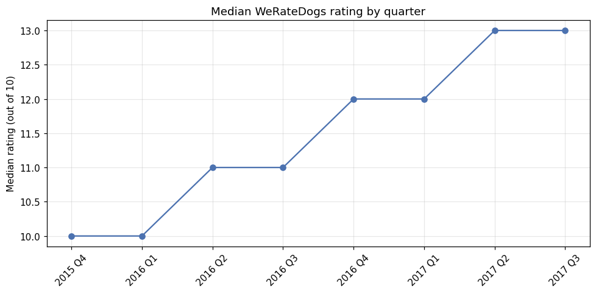
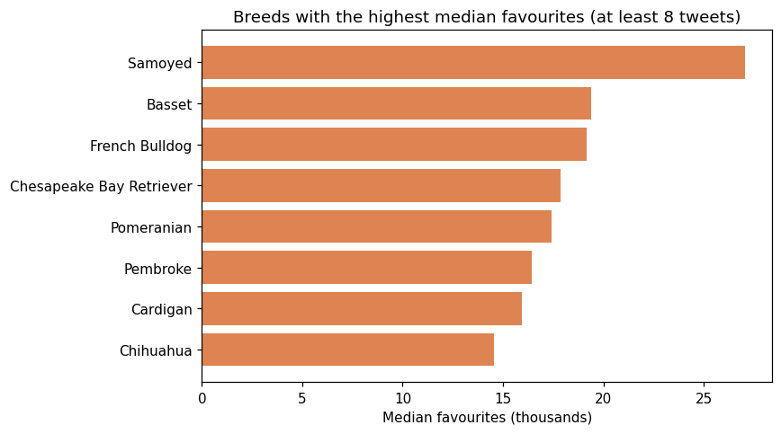

# Wrangling and Analysing WeRateDogs Twitter Data

## Overview

WeRateDogs is a Twitter account that rates people's dogs with humorous comments and ratings that usually exceed 10 out of 10. This project gathers data about its tweets from three sources, documents and fixes their quality and tidiness problems, and analyses the cleaned data to find out how the account's ratings changed over time and what drives audience engagement.

## Data

The project combines three sources: the WeRateDogs tweet archive of 2,356 tweets (`twitter_archive_enhanced.csv`), breed predictions from a neural network applied to each tweet's photo (`image_predictions.tsv`, originally downloaded with the Requests library), and retweet and favourite counts collected through the Twitter API with Tweepy (`tweet_json.txt`). The Twitter API is no longer freely available, so the notebook loads the saved files and keeps the original collection code for reference. The cleaned master dataset is saved as `twitter_archive_master.csv`.

## Approach

The assessment identified twelve quality issues and three tidiness issues, each cleaned with a documented define, code and test step. Retweets and replies were removed so that only original ratings remain. Lowercase words recorded as dog names, such as "a" and "the", were set to missing rather than replaced with invented names. Ratings were re-extracted from the tweet text to capture decimals and skip fractions such as "24/7", which corrected 30 ratings, and all ratings were converted to a common scale out of 10. The four dog stage columns were combined into one, the nine prediction columns were reduced to the most confident dog breed per image, and the three tables were merged into a single master dataset of 1,971 original tweets with images.

## Key Findings

WeRateDogs' ratings inflated steadily: the median rating rose from 10/10 in late 2015 to 13/10 by mid-2017.

Golden retrievers appear most often, but Samoyeds attract the most engagement, with a median of about 27,000 favourites per tweet. Favourites and retweets are very strongly correlated (Spearman's ρ = 0.90). Higher-rated tweets receive more favourites, and a regression that controls for posting date shows this is not only because later tweets were both rated higher and seen by more followers: each extra rating point is associated with about 8% more favourites.

## Limitations

Engagement data covers only 650 tweets from July 2016 to August 2017, because many tweets could no longer be retrieved from the API. Breed labels come from an image classifier and may contain errors, and the small number of tweets per breed makes the engagement rankings indicative rather than definitive. The rating and engagement relationship is an observational association, not a causal effect.

## Skills Demonstrated

This project demonstrates gathering data from files, a web download and an API, systematic data quality and tidiness assessment, programmatic cleaning with tests, regular expressions, merging multiple sources, and exploratory and regression analysis.

## How to Run

Install the dependencies with `pip install -r requirements.txt` and open `werate_dogs_wrangling_analysis.ipynb` in Jupyter. All data files are included in the repository.

## Tools

Python, pandas, NumPy, SciPy, statsmodels, Matplotlib and Jupyter Notebook.
